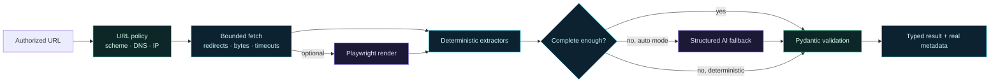

<p align="center">
  
</p>

<p align="center">
  <a href="https://github.com/Z-MarkUs/OmniScrape/actions/workflows/ci.yml"></a>
  <a href="https://github.com/Z-MarkUs/OmniScrape/releases/latest"></a>
  
  <a href="https://github.com/Z-MarkUs/OmniScrape/blob/main/LICENSE"></a>
  
</p>

<p align="center">
  <strong>Turn an authorized web page into validated article or product data—locally first, with browser and AI escalation only when requested.</strong>
</p>

OmniScrape is a secure hybrid extraction service and Python toolkit. It combines
machine-readable metadata, readability parsing, and DOM heuristics behind one typed
contract; optional Playwright rendering handles JavaScript pages, while an optional
OpenAI Responses adapter fills incomplete fields in explicitly selected AI modes.

This repository is deliberately built as more than a scraping script. It demonstrates
outbound-request security, async resource limits, typed boundaries, provider isolation,
API authentication, streaming progress, reproducible tests and benchmarks, container
hardening, and portable project skills for coding agents.

## Engineering proof

| Signal | Inspectable evidence |
| --- | --- |
| Supported runtime | The [CI workflow](https://github.com/Z-MarkUs/OmniScrape/actions/workflows/ci.yml) runs offline tests on every Python version from 3.10 through 3.13 plus a separate loopback-only real-Chromium regression gate. |
| Quality and security gates | [Verification](#verification) enforces at least 90% combined statement-and-branch coverage alongside Ruff, strict mypy, Bandit, dependency auditing, and [CodeQL](https://github.com/Z-MarkUs/OmniScrape/actions/workflows/codeql.yml). |
| Distribution checks | CI validates the wheel and source archive, installs each exact artifact in a fresh environment, and smoke-tests the non-root container with a read-only root filesystem. |
| Release integrity | The [latest release](https://github.com/Z-MarkUs/OmniScrape/releases/latest) is immutable and ships checksums plus signed SLSA build provenance; the [verification commands](#release-integrity) are public and reproducible. |
| Agent contract | MCP publishes enumerated inputs, a discriminated success/error schema, and safe tool hints; the [Codex and Claude Code project skills](#project-skills-for-codex-and-claude-code) are synchronized byte-for-byte and checked by CI. |

<p align="center">
  
  <br>
  <sub>Credential-free deterministic extraction of IANA's example.com in the bundled console; timings vary by network.</sub>
</p>

> **Use responsibly.** Extract only content you are authorized to access. Respect site
> terms, robots directives, access controls, privacy, copyright, rate limits, and
> applicable law. OmniScrape does not include CAPTCHA, paywall, authentication, or
> anti-bot bypasses.

## Why OmniScrape

| Design goal | Implementation |
| --- | --- |
| Useful without a paid model | Deterministic JSON-LD, microdata, metadata, readability, and heuristic extraction |
| Safe outbound networking | HTTP(S)-only policy, credential rejection, DNS/IP checks, redirect revalidation, peer checks, byte caps, and timeouts |
| Controlled AI escalation | Separate `deterministic`, `auto`, and `llm` modes; validated structured output; real provider usage only |
| One contract everywhere | The same Pydantic models power the Python library, CLI, FastAPI service, SSE stream, web UI, and MCP tool |
| Production-minded operation | Optional API-key auth, bounded concurrency, safe error responses, non-root container, health checks, and CI security gates |
| Agent-friendly maintenance | Synchronized Codex and Claude Code project skills encode safe workflows and verification commands |

## Pipeline



The deterministic path is the default because it is reproducible, private, and free.
Python, CLI, HTTP, MCP, and the web console all use it when no mode is supplied;
`auto` and `llm` remain explicit opt-ins. Rendering and AI are independent choices:
a page can be rendered without using a model, and an already-fetched document can use
a model without browser automation.

For rebinding safety, browser mode pins the validated page hostname to one public IP and
allows same-origin scripts/styles/XHR only; cross-origin subresources are blocked. This
deliberate tradeoff keeps the renderer inside the same outbound trust boundary, but a
CDN-dependent application may extract better through its server-rendered HTML.

Browser rendering executes target-controlled JavaScript. The HTTP API therefore rejects
`render: true` by default. Enable it with `OMNISCRAPE_ENABLE_API_RENDERING=true` only for
trusted, explicitly authorized targets and keep the default
`OMNISCRAPE_MAX_RENDER_CONCURRENCY=2` (the strict supported values are `1` and `2`).
The CLI, Python API, and MCP renderer remain explicit caller choices and are not enabled
by this HTTP-specific switch.

### Extraction modes

| Mode | Network behavior after fetching the page | Best for |
| --- | --- | --- |
| `deterministic` | No provider call | CI, private data, reproducible runs, and most structured pages |
| `auto` | Calls the configured provider only below the completeness threshold | Mixed corpora where selective cost and data egress are acceptable |
| `llm` | Sends extracted page context to the configured provider | Explicit provider-backed extraction |

Legacy values `none`, `sd`, and `local` are accepted as aliases for `deterministic`.

## Quick start

OmniScrape supports Python 3.10–3.13.

The installable distribution is named `omniscrape-zmarkus` to avoid colliding
with an unrelated project already using the generic PyPI name. The Python import,
CLI command, and repository name remain `omniscrape` / OmniScrape.

Install the latest immutable release directly from GitHub:

```bash
python -m pip install https://github.com/Z-MarkUs/OmniScrape/releases/download/v0.2.2/omniscrape_zmarkus-0.2.2-py3-none-any.whl
```

For an editable source checkout instead:

```bash
python -m venv .venv
# macOS/Linux: source .venv/bin/activate
# Windows PowerShell: .venv\Scripts\Activate.ps1
python -m pip install --upgrade pip
python -m pip install -e .
```

Set a URL you own or are authorized to test:

```bash
python -m omniscrape extract "$TARGET_URL" --kind article --mode deterministic --pretty
```

Optional capabilities are installed independently:

```bash
python -m pip install -e ".[browser]"  # Playwright renderer
python -m playwright install chromium

python -m pip install -e ".[llm]"      # OpenAI Responses adapter
python -m pip install -e ".[mcp]"      # MCP server
```

Copy `.env.example` as a reference, but load secrets through your environment or
secret manager. Never commit a populated `.env` file.

## Use it from every surface

### Python

```python
import asyncio
import os

from omniscrape import extract


async def main() -> None:
    result = await extract(
        os.environ["TARGET_URL"],
        kind="article",
        mode="deterministic",
    )
    print(result.data.title)
    print(result.metadata.sources)


asyncio.run(main())
```

For connection reuse or dependency injection, use the async client:

```python
from omniscrape import OmniScrape

async with OmniScrape() as client:
    result = await client.extract(
        target_url,
        kind="product",
        mode="deterministic",
        render=False,
    )
```

Omitting `mode` from either Python callable selects `deterministic`. An ambient
`OPENAI_API_KEY` configures a lazy provider but does not import the optional SDK or
construct a provider client during deterministic extraction. Internally created OpenAI
clients are closed by `OmniScrape.aclose()`; an injected provider client remains
caller-owned unless `owns_client=True` explicitly transfers ownership.

### CLI

```bash
python -m omniscrape --help
python -m omniscrape --version
python -m omniscrape extract "$TARGET_URL" --kind product --mode auto --render --compact
python -m omniscrape serve --host 127.0.0.1 --port 8000
python -m omniscrape mcp
```

### HTTP API and web console

```bash
python -m omniscrape serve --host 127.0.0.1 --port 8000
```

Open [http://127.0.0.1:8000](http://127.0.0.1:8000) for the responsive extraction
console, or call the versioned endpoint:

```bash
curl --request POST http://127.0.0.1:8000/v1/extract \
  --header "Content-Type: application/json" \
  --data "{\"url\":\"$TARGET_URL\",\"kind\":\"article\",\"mode\":\"deterministic\",\"render\":false}"
```

Set `OMNISCRAPE_API_KEY` to require either `X-API-Key` or a Bearer token on
extraction routes. When authentication is configured, OpenAPI advertises both
alternatives so the generated `/docs` console can authorize requests accurately.
The request `mode` field is optional and defaults to
`deterministic`. The request `render` field returns `403 rendering_disabled` unless
`OMNISCRAPE_ENABLE_API_RENDERING=true`; installation of the browser extra alone does not
enable API rendering. Health remains available at `GET /health` and distinguishes the
renderer policy (`renderer_enabled`) from runtime readiness (`renderer_available`).

| Route | Purpose |
| --- | --- |
| `GET /` | Dependency-free web console |
| `GET /health` | Typed service capability check |
| `POST /v1/extract` | JSON request and result |
| `POST /v1/extract/stream` | Named server-sent progress events ending in `complete` or `error` |
| `GET /docs` | OpenAPI explorer generated by FastAPI |

Unversioned extraction routes remain hidden legacy aliases. `/healthz` is a hidden
container-health alias; clients should use `/health`.

Renderer health is deliberately fail-closed:

| `renderer_enabled` | `renderer_available` | Meaning |
| --- | --- | --- |
| `false` | `false` | API policy is off; no Chromium readiness probe runs |
| `true` | `false` | Policy is on, but Playwright or Chromium is not ready |
| `true` | `true` | Policy is on and Chromium passed its readiness probe |

`renderer_available` is effective API readiness, not a package-installation signal.

### Container

The production image runs as an unprivileged user and expects API authentication when
binding outside loopback. Set `OMNISCRAPE_API_KEY` in your shell or an untracked local
`.env`, then start the local-only Compose profile:

```bash
docker compose up --build
```

Compose publishes only `127.0.0.1:8000`, drops Linux capabilities, enables
`no-new-privileges`, and uses a read-only root filesystem with a bounded temporary
filesystem. The checked-in image installs neither the browser extra nor Chromium, so it
is deterministic-only unless you deliberately build a separate browser-enabled image;
the stock Compose profile intentionally does not forward renderer settings, and setting
the API-rendering flag alone will not make the renderer ready.

If you build a browser-enabled deployment, run the browser-enabled API in a dedicated
container or VM isolated from sensitive workloads and apply external CPU, memory, and
process limits (for example, Docker or orchestrator CPU/memory/PID quotas). Application
semaphores, timeouts, and Chromium flags bound normal work but are not substitutes for
OS-enforced isolation. Do not expose API rendering as a general-purpose public service;
restrict its callers and targets to a trusted, authorized set.

### MCP

Install the `mcp` extra and launch a stdio server:

```bash
python -m omniscrape mcp
```

The server advertises one focused tool, `extract`, with `url`, `kind`, `mode`,
and `render` arguments. Its schema enumerates supported kinds and modes, returns
the shared discriminated success/error contract without an extra wrapper, and marks
the operation read-only, non-destructive, and idempotent. The default mode remains
`deterministic`; agent integrations can explicitly select `auto` or `llm` only when
provider-backed processing was authorized.

## Result contract

Every successful surface returns the same discriminated article or product payload and
auditable execution metadata. Missing source facts remain `null`; OmniScrape does not
invent them.

```json
{
  "success": true,
  "url": "https://authorized.example/story",
  "final_url": "https://authorized.example/story",
  "kind": "article",
  "mode": "deterministic",
  "data": {
    "kind": "article",
    "url": "https://authorized.example/story",
    "title": "Example title",
    "author": "Example author",
    "text": "Extracted source text",
    "images": []
  },
  "metadata": {
    "sources": ["json-ld", "readability"],
    "content_bytes": 1842,
    "redirect_count": 0,
    "rendered": false,
    "completeness_score": 0.9
  }
}
```

The values above illustrate the schema; measured metadata is derived from each real run.
Provider token usage is included only when the provider reports it—never estimated or
randomly generated.

## Security model

OmniScrape treats a URL as untrusted input and fetched HTML as untrusted data.

| Threat | Control |
| --- | --- |
| SSRF through literal IPs or DNS | Reject loopback, private, link-local, reserved, multicast, and non-global destinations |
| SSRF through redirects or rebinding | Revalidate every redirect, connect HTTP directly to a validated IP while preserving Host/SNI, and pin Chromium's same-origin hostname |
| Credential smuggling | Reject URLs containing user information |
| Resource exhaustion | Bound request-body/connect/read/render/queue time, redirect and request counts, deterministic markup structure, aggregate renderer transfer bytes, final DOM size, image count, and concurrent work; require external CPU/memory/process quotas for browser deployments |
| Accidental provider use | Deterministic default, explicit modes, optional dependency, and visible provider metadata |
| Secret leakage | Environment-only credentials, redacted errors, secret scanning, push protection, and a documented response process |
| Unsafe service exposure | Loopback CLI default, optional constant-time API-key checks, non-root read-only container |
| Target-controlled JavaScript | API rendering disabled by default, trusted-target-only enablement guidance, same-origin egress policy, and external browser isolation |
| Untrusted output in the demo UI | Render result data as text rather than injecting returned HTML |

See [SECURITY.md](https://github.com/Z-MarkUs/OmniScrape/blob/main/SECURITY.md) for
private reporting and safe-research scope.

## Verification

All ordinary tests are fixture-backed and avoid paid services and arbitrary live targets.

```bash
python -m pip install -e ".[dev]"

python -m pytest -m "not live"
python -m ruff check src tests benchmarks
python -m ruff format --check src tests benchmarks
python -m mypy src/omniscrape
python -m bandit -q -r src/omniscrape
python -m pip_audit --skip-editable
python -m build
```

Or run the main local merge gate:

```bash
make check
```

The release gate enforces at least 90% combined statement-and-branch coverage. It also
runs controlled, loopback-only real-Chromium regressions when the browser test extra is
available. Ruff, strict mypy, Bandit, dependency audits, skill validation, and
wheel/source-archive validation are separate blocking gates.

CI repeats the offline suite and branch-coverage gate on every supported Python version
from 3.10 through 3.13. Separate Python 3.12 jobs enforce linting, strict type checking,
package validation, fresh-environment installs of the exact wheel and source archive,
dependency auditing, static security analysis, and the production container build.

### Release integrity

Version tags publish only after the complete CI gate succeeds. Tag CI accepts exact
SemVer tags and matching wheel/source-archive metadata, then creates signed
GitHub/Sigstore SLSA provenance for both distributions. A protected default-branch
workflow revalidates the tag's `main` ancestry and provenance, writes `SHA256SUMS`, and
publishes the release. Repository-level immutability locks the published tag and every
asset and adds a separate release attestation.

After downloading an artifact, verify its provenance with GitHub CLI:

```bash
gh attestation verify omniscrape_zmarkus-0.2.2-py3-none-any.whl \
  --repo Z-MarkUs/OmniScrape \
  --source-ref refs/tags/v0.2.2 \
  --signer-workflow Z-MarkUs/OmniScrape/.github/workflows/ci.yml
gh release verify v0.2.2 --repo Z-MarkUs/OmniScrape
```

The complete maintainer process is documented in
[RELEASING.md](https://github.com/Z-MarkUs/OmniScrape/blob/main/RELEASING.md).

## Reproducible benchmark

The benchmark exercises the checked-in article and product fixtures with deterministic
extractors only. It records the package version, Python and platform details, fixture
hashes, iteration count, throughput, and distribution statistics in machine-readable
JSON.

```bash
python benchmarks/run.py --iterations 100 --output benchmarks/results/latest.json
```

Fixture results are a regression signal, not a promise about arbitrary websites. The
benchmark command, corpus, environment, and correctness tests must remain identical
before describing a performance change.

## Project skills for Codex and Claude Code

The canonical project skill lives at `.agents/skills/omniscrape/SKILL.md`; a portable
byte-identical copy lives at `.claude/skills/omniscrape/SKILL.md`.

- In Codex, invoke `$omniscrape` or let the skill description route relevant work.
- In Claude Code, invoke `/omniscrape`.
- The skill defaults to offline fixtures, deterministic mode, and full verification.
- It explicitly forbids access-control bypasses, secret handling in commands, invented
  live targets, and unverified performance claims.

After editing portable skill content:

```bash
python scripts/sync_agent_skills.py
python scripts/sync_agent_skills.py --check
```

Codex-specific UI metadata stays under `.agents`; only portable files are mirrored.

## Repository map

```text
.
├── .agents/skills/omniscrape/   # canonical Codex project skill
├── .claude/skills/omniscrape/   # synchronized Claude Code skill
├── .github/                     # CI, release automation, and dependency updates
├── benchmarks/                  # fixture-backed benchmark and JSON results
├── docs/assets/                 # repository visuals
├── RELEASING.md                 # immutable, attested release process
├── scripts/                     # skill synchronization
├── src/omniscrape/
│   ├── extractors/              # structured, readability, and heuristic layers
│   ├── providers/               # optional provider protocol and OpenAI adapter
│   ├── web/                     # dependency-free browser console
│   ├── api.py                   # FastAPI factory and SSE surface
│   ├── fetcher.py               # bounded HTTP and Playwright fetching
│   ├── pipeline.py              # deterministic / auto / llm orchestration
│   └── security.py              # URL and address policy
└── tests/                       # offline contract, security, and regression tests
```

## Contributing

Read [CONTRIBUTING.md](https://github.com/Z-MarkUs/OmniScrape/blob/main/CONTRIBUTING.md),
add an offline regression fixture for behavior
changes, and keep every public surface consistent when the shared result contract moves.
Security reports belong in GitHub's private vulnerability-reporting flow, not a public
issue.

## Migrating from the prototype

Version 0.2 replaces the experimental multi-route server with one supported extraction
contract. Use `/health` instead of `/health.json`; `/status*`, `/monitor`, `/crawl*`,
`/crawler`, and `/labs*` are intentionally removed. The supported unversioned
`/extract` and `/extract-stream` aliases remain, but new integrations should use the
versioned `/v1/extract` routes.

## License

[MIT](https://github.com/Z-MarkUs/OmniScrape/blob/main/LICENSE) © Hehan Zhao.
